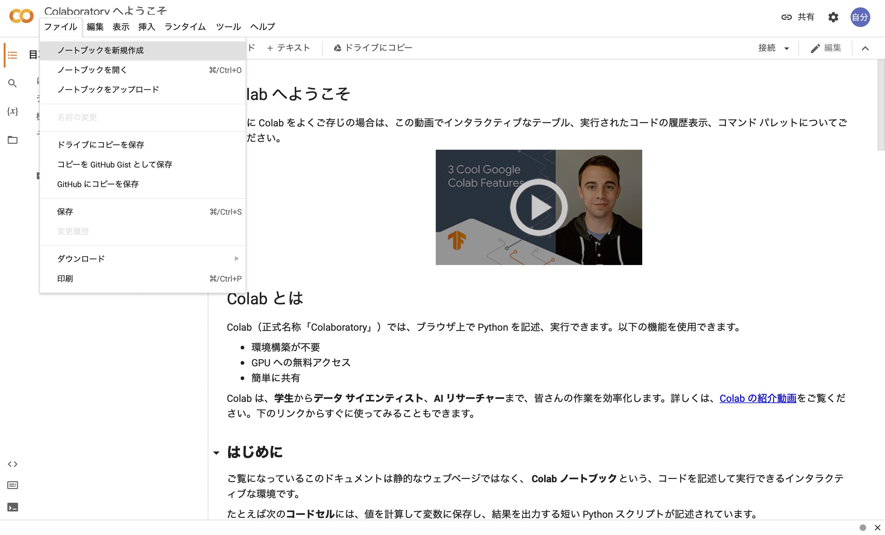
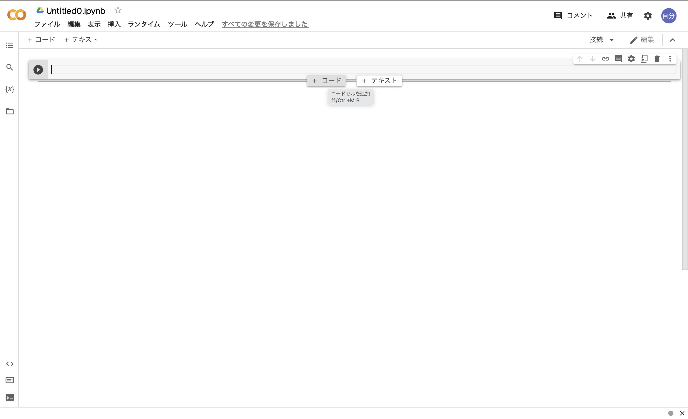

# この声優とあの声優（たち）が共演しているのか調べたい
まずは[Google Colaboratory](https://colab.research.google.com)をブラウザで表示する。



ファイル->ノートブックを新規作成を開く。



「コード」を押すと入力できる。

コードの部分に以下を入力してみる。


```python
pip install wikipedia
```

これはwikipediaの全文を取り込むものである。次のように出力される。


```python
pip install wikipedia
```

    Collecting wikipedia
      Downloading wikipedia-1.4.0.tar.gz (27 kB)
      Preparing metadata (setup.py) ... [?25ldone
    [?25hRequirement already satisfied: beautifulsoup4 in /Library/Frameworks/Python.framework/Versions/3.10/lib/python3.10/site-packages (from wikipedia) (4.11.1)
    Collecting requests<3.0.0,>=2.0.0
      Downloading requests-2.28.0-py3-none-any.whl (62 kB)
         ━━━━━━━━━━━━━━━━━━━━━━━━━━━━━━━━━━━━━━━━ 62.8/62.8 kB 2.1 MB/s eta 0:00:00
    [?25hCollecting urllib3<1.27,>=1.21.1
      Downloading urllib3-1.26.9-py2.py3-none-any.whl (138 kB)
         ━━━━━━━━━━━━━━━━━━━━━━━━━━━━━━━━━━━━━━━ 139.0/139.0 kB 3.5 MB/s eta 0:00:00a 0:00:01
    [?25hCollecting idna<4,>=2.5
      Downloading idna-3.3-py3-none-any.whl (61 kB)
         ━━━━━━━━━━━━━━━━━━━━━━━━━━━━━━━━━━━━━━━━ 61.2/61.2 kB 2.2 MB/s eta 0:00:00
    [?25hCollecting certifi>=2017.4.17
      Downloading certifi-2022.6.15-py3-none-any.whl (160 kB)
         ━━━━━━━━━━━━━━━━━━━━━━━━━━━━━━━━━━━━━━━ 160.2/160.2 kB 3.2 MB/s eta 0:00:00a 0:00:01
    [?25hCollecting charset-normalizer~=2.0.0
      Downloading charset_normalizer-2.0.12-py3-none-any.whl (39 kB)
    Requirement already satisfied: soupsieve>1.2 in /Library/Frameworks/Python.framework/Versions/3.10/lib/python3.10/site-packages (from beautifulsoup4->wikipedia) (2.3.2.post1)
    Using legacy 'setup.py install' for wikipedia, since package 'wheel' is not installed.
    Installing collected packages: urllib3, idna, charset-normalizer, certifi, requests, wikipedia
      WARNING: The script normalizer is installed in '/Library/Frameworks/Python.framework/Versions/3.10/bin' which is not on PATH.
      Consider adding this directory to PATH or, if you prefer to suppress this warning, use --no-warn-script-location.
      Running setup.py install for wikipedia ... [?25ldone
    [?25hSuccessfully installed certifi-2022.6.15 charset-normalizer-2.0.12 idna-3.3 requests-2.28.0 urllib3-1.26.9 wikipedia-1.4.0
    Note: you may need to restart the kernel to use updated packages.


次のコードを出して以下を入力する。


```python
import wikipedia
#ライブラリの読み込み

wikipedia.set_lang("ja") 
#言語を日本語に設定
def check(humans : list):
    ans = set()
    #関数で返すアニメのset
    for name in humans:
        Aset = set()
        
        page = wikipedia.page(name, auto_suggest=False)
        #Wikipediaの全文を取得
        
        txt = page.content
        #pageの本文にする
        
        List = list(txt.split('\n'))
        #改行文字で分けてリスト化する
        
        t = List.index('=== テレビアニメ ===')
        p = len(List)
        if '=== 劇場アニメ ===' in List:
            p = List.index('=== 劇場アニメ ===')
        if '=== ゲーム ===' in List:
            p = min(p,List.index('=== ゲーム ==='))
        for i in range(t,p+1):
            anime = List[i]
            if '（' in anime:
                z = anime.find('（')
                Aset.add(anime[:z])
        if ans == set():
            ans = Aset
        else:
            ans &= Aset
    return ans
p = ['竹達彩奈','梶裕貴']
print(check(p))

```

    {'ポプテピピック', 'ポケットモンスター ベストウイッシュ シーズン2', 'ハイスクールD×D', 'スペース☆ダンディ', 'ポケットモンスター', 'STAR DRIVER 輝きのタクト', '妖怪学園Y 〜Nとの遭遇〜', 'メガトン級ムサシ', 'ギルティクラウン'}


出力されたものは梶裕貴と竹達彩奈が共演しているアニメの羅列である。今はpを竹達彩奈と梶裕貴にしたからそうなったが、他の声優（三人以上でも可）を''の中に入れれば同様に検索できる。

梶裕貴と竹達彩奈がポケットモンスター ベストウイッシュ シーズン2で共演していたのは意外だった...と思ったらどうやら脇役だった様子。XYでは梶裕貴がシトロン役だったので脇役ではない？ポプテピピックも地味に意外

あとローカルな環境でも`Pip install wikipedia`ができることがわかったのが収穫。

## 参考文献
[この声優さんたちって共演してる気がする！！！](https://qiita.com/Kintetsu_Pearls/items/8d3f02ccfd72008fb910)

## ホームページ
[ホームページ](https://yumannimac.github.io/first/)

<script src="https://blz-soft.github.io/md_style/release/v1.2/md_style.js" ></script>

