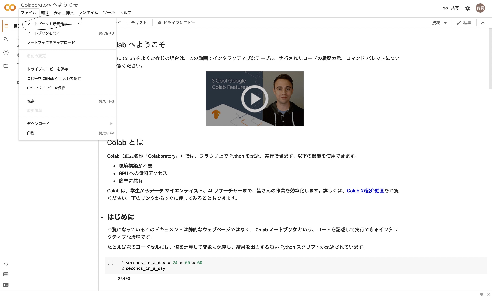
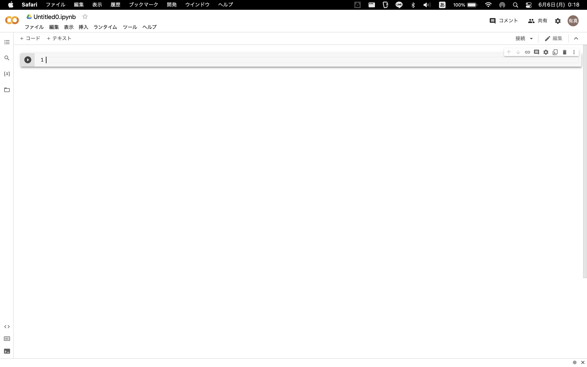
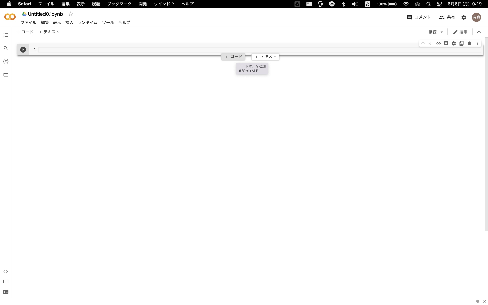

# この声優とあの声優（たち）が共演しているのか調べたい
まずは[Google Colaboratory](https://colab.research.google.com)をブラウザで表示する。



画像のようにファイル->ノートブックを新規作成を開くと下のようになる。（カーソルを当てると左のようになる）





「コード」を押すと入力できる。

コードの部分にまずは以下を入力してみる。


```python
pip install wikipedia
```

これはwikipediaの全文を取り込むものである。次のように出力される。


```python
pip install wikipedia
```

    Defaulting to user installation because normal site-packages is not writeable
    Collecting wikipedia
      Downloading wikipedia-1.4.0.tar.gz (27 kB)
      Preparing metadata (setup.py) ... [?25ldone
    [?25hRequirement already satisfied: beautifulsoup4 in /Users/shimamurayuushin/Library/Python/3.8/lib/python/site-packages (from wikipedia) (4.10.0)
    Requirement already satisfied: requests<3.0.0,>=2.0.0 in /Users/shimamurayuushin/Library/Python/3.8/lib/python/site-packages (from wikipedia) (2.21.0)
    Requirement already satisfied: certifi>=2017.4.17 in /Users/shimamurayuushin/Library/Python/3.8/lib/python/site-packages (from requests<3.0.0,>=2.0.0->wikipedia) (2022.5.18.1)
    Requirement already satisfied: idna<2.9,>=2.5 in /Users/shimamurayuushin/Library/Python/3.8/lib/python/site-packages (from requests<3.0.0,>=2.0.0->wikipedia) (2.8)
    Requirement already satisfied: chardet<3.1.0,>=3.0.2 in /Users/shimamurayuushin/Library/Python/3.8/lib/python/site-packages (from requests<3.0.0,>=2.0.0->wikipedia) (3.0.4)
    Requirement already satisfied: urllib3<1.25,>=1.21.1 in /Users/shimamurayuushin/Library/Python/3.8/lib/python/site-packages (from requests<3.0.0,>=2.0.0->wikipedia) (1.24.3)
    Requirement already satisfied: soupsieve>1.2 in /Users/shimamurayuushin/Library/Python/3.8/lib/python/site-packages (from beautifulsoup4->wikipedia) (2.3.1)
    Building wheels for collected packages: wikipedia
      Building wheel for wikipedia (setup.py) ... [?25ldone
    [?25h  Created wheel for wikipedia: filename=wikipedia-1.4.0-py3-none-any.whl size=11686 sha256=bdbc9e9282a2c6ed1e2ad755a017c392a3f9ee64ba8c1bc631204ee22d2b9f6b
      Stored in directory: /Users/shimamurayuushin/Library/Caches/pip/wheels/07/93/05/72c05349177dca2e0ba31a33ba4f7907606f7ddef303517c6a
    Successfully built wikipedia
    Installing collected packages: wikipedia
    Successfully installed wikipedia-1.4.0
    WARNING: There was an error checking the latest version of pip.
    Note: you may need to restart the kernel to use updated packages.


次のコードを出して以下を入力する。


```python
import wikipedia
#ライブラリの読み込み

wikipedia.set_lang("ja") 
#言語を日本語に設定
def check(humans : list):
    ans = set()
    #関数で返すアニメのset
    for name in humans:
        Aset = set()
        
        page = wikipedia.page(name, auto_suggest=False)
        #Wikipediaの全文を取得
        
        txt = page.content
        #pageの本文にする
        
        List = list(txt.split('\n'))
        #改行文字で分けてリスト化する
        
        t = List.index('=== テレビアニメ ===')
        p = len(List)
        if '=== 劇場アニメ ===' in List:
            p = List.index('=== 劇場アニメ ===')
        if '=== ゲーム ===' in List:
            p = min(p,List.index('=== ゲーム ==='))
        for i in range(t,p+1):
            anime = List[i]
            if '（' in anime:
                z = anime.find('（')
                Aset.add(anime[:z])
        if ans == set():
            ans = Aset
        else:
            ans &= Aset
    return ans
p = ['竹達彩奈','梶裕貴']
print(check(p))

```

    {'スペース☆ダンディ', 'ポケットモンスター', 'ギルティクラウン', '妖怪学園Y 〜Nとの遭遇〜', 'ポプテピピック', 'ハイスクールD×D', 'メガトン級ムサシ', 'ポケットモンスター ベストウイッシュ シーズン2', 'STAR DRIVER 輝きのタクト'}


出力されたものは梶裕貴と竹達彩奈が共演しているアニメの羅列である。今はpを竹達彩奈と梶裕貴にしたからそうなったが、他の声優（三人以上でも可）を''の中に入れれば同様に検索できる。

## 参考文献
[この声優さんたちって共演してる気がする！！！](https://qiita.com/Kintetsu_Pearls/items/8d3f02ccfd72008fb910)

## ホームページ
[ホームページ](https://yumannimac.github.io/first/)

<script src="https://blz-soft.github.io/md_style/release/v1.2/md_style.js" ></script>
